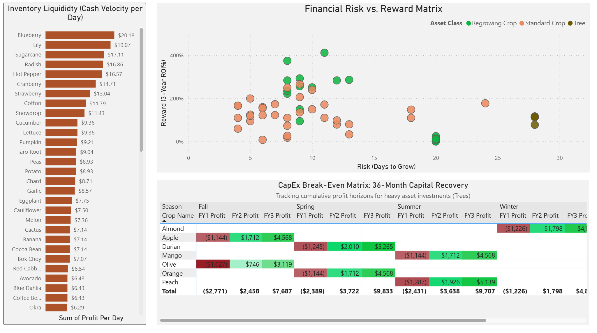

# Retail CapEx & Inventory Operations Analysis (Coral Island Economy Simulation)

This project simulates real-world supply chain and capital expenditure challenges using in-game farming mechanics to track cumulative profits, amortize multi-season investments, and calculate precise break-even horizons.

## Business Problem

Operational managers are bound by strict resource constraints: limited upfront capital, fixed spatial footprints, and finite timeframes. Relying on top-line gross revenue or intuition routinely confuses high sales volume with actual capital efficiency.

To solve this, I engineered a custom dataset tracking 91 distinct agricultural assets over a 3-year (12-season) horizon. Because the simulation operates on a unique calendar (four 28-day seasons), standard Time Intelligence (TI) date tables were incompatible. The resulting data model replaces intuitive guessing with a structured, data-driven financial approach to answer three critical operational questions:

* **Liquidity:** Which specific assets provide the highest daily cash velocity to fund short-term operations?
* **Capital Efficiency:** Which assets yield the highest return on invested capital (ROI) given a strict spatial footprint?
* **CapEx Amortization:** When do heavy upfront capital expenditures transition from liabilities into profitable assets?

## Core Features & Functionality

* **Custom Temporal Data Model:** Engineered a custom DAX temporal data model to map a unique 28-day, 4-season operational calendar, enabling accurate year-over-year tracking across 91 distinct assets without standard Time Intelligence date tables.
* **Liquidity Leaderboard:** Built a clustered bar chart to track daily cash velocity, isolating fast-turning inventory to prove a top 10% catalog fraction (e.g., Blueberries at $20.18/day) drives the vast majority of daily cash flow.
* **Financial Risk vs. Reward Matrix:** Developed a scatter plot segmenting assets by operational lockup and 3-Year ROI, separating high-yield regrowing assets (up to 2060% ROI) from high-cost, long-term capital traps (~114% ROI).
* **CapEx Break-Even Matrix:** Programmed conditional heat-mapping to track 36-month capital recovery, pinpointing the exact financial inflection point where high-cost investments shift from a Year 1 deficit (up to $1,627) to a Year 3 profit (up to $5,265).

## Tech Stack & Data Architecture

* **Data Collection & Cleaning:** Extracted and structured a raw dataset of 91 unique multi-season assets using Microsoft Excel, ensuring row-level accuracy across complex growth lifecycles.
* **Data Modeling & Analytics:** Engineered a scalable relational data model in Power BI, utilizing DAX to write custom seasonal/yield logic (e.g., Max Harv per Season, Total Rev per Season) and financial performance metrics (e.g., 3-Year ROI %, CapEx Break-Even (Days)).
* **Version Control:** Managed project iterations and documentation via Git and GitHub.

## Strategic Insights & Recommendations

The data dictates a bimodal inventory procurement strategy, sharply dividing short-term cash engines from long-term capital expenditures.

1. **Maximize Liquid Assets:** Operations must dedicate the majority of the budget and spatial footprint to elite "Cash Cow" regrowing crops (Blueberries, Lilies, Sugarcane) to guarantee daily positive cash flow.
2. **Purge Bottom-Tier Inventory:** Standard crops yielding under $5/day (Peonies, Artichokes) must be aggressively phased out, as they consume the same spatial footprint for a fraction of the return.
3. **Cap Long-Term CapEx:** Procurement must restrict purchasing high-cost CapEx assets (Trees) until the fast-turning inventory generates a 12-month liquidity buffer to absorb Year 1 deficits. Total long-term CapEx allocation should be strictly capped at 15% of the overall portfolio.

## Installation & Deployment

To run this analysis locally and interact with the Power BI financial report page:

1. **Clone the repository:**
   `git clone https://github.com/etna9088/coral-island-analytics.git`

2. **Access the Data:** The raw dataset is located in the Data folder at `Data/Crops_Data.xlsx`.

3. **Open the Report:** The visuals and DAX measures are contained within the Power BI project file located in the Reports folder at `Reports/coral-island-analytics.pbix`. You must have the latest version of Power BI Desktop installed to view it.
